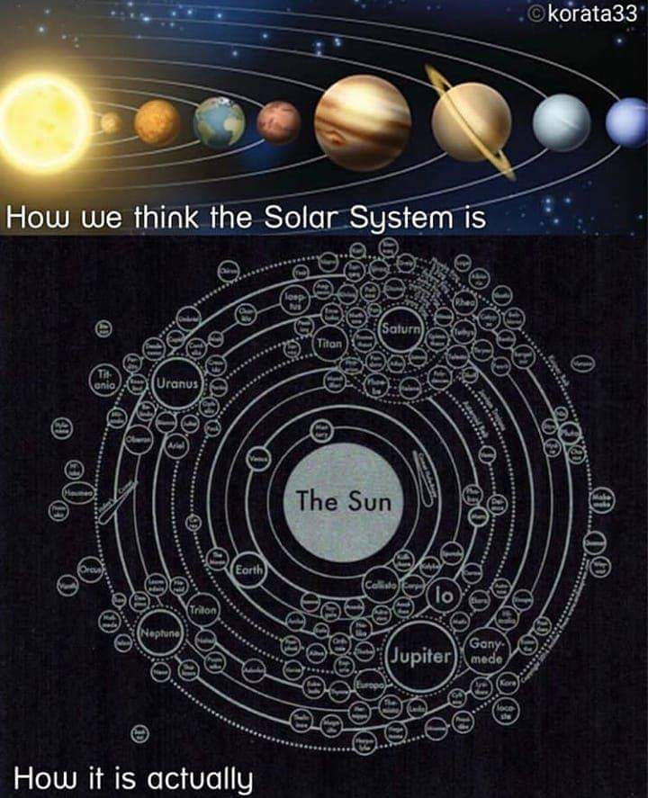

[](https://travis-ci.com/donofden/galactic)
[](https://codecov.io/gh/donofden/galactic)
[](https://www.codefactor.io/repository/github/donofden/galactic)
[](https://opensource.org/licenses/MPL-2.0)
[](https://www.python.org/downloads/release/python-370/)

# Galactic

Galactic is project which binds software with outer space, its a fun project to understand outerspace and [Python](https://www.python.org/) :)

A CLI Application, where you enter your weight. The application will calculate your weight in other planets in solar system, including our star (SUN).

## Aim of the application

- To learn how to `structure` a Python project.
- To understand [`Python`](https://www.python.org/) **Classes and Objects**
- To learn `Python Unittest`.
- To learn more about `setup.py` files.
- [`Travis CI`](https://travis-ci.com/donofden/galactic) usage and implementation for Python Project.
- To Learn [`Codecov`](https://codecov.io) integration with [`Travis CI`](https://travis-ci.com/donofden/galactic).



## The Relationship Between Gravity and Mass and Distance

Your weight is a measure of the pull of gravity between you and the body you are standing on. This force of gravity depends on a few things.

First, it depends on your mass and the mass of the planet you are standing on. If you double your mass, gravity pulls on you twice as hard. If the planet you are standing on is twice as massive, gravity also pulls on you twice as hard. On the other hand, the farther you are from the center of the planet, the weaker the pull between the planet and your body. The force gets weaker quite rapidly. If you double your distance from the planet, the force is one-fourth. If you triple your separation, the force drops to one-ninth. Ten times the distance, one-hundredth the force. See the pattern? The force drops off with the square of the distance.

## How to Install and Run

- Run the following command to know the availabe options.

Install

```make
make init
```

To Check Unittest

```make
make test
```

To generate Coverage Report

```make
make test-cov
```

To Start

```make
make start
```

## Usage

- Run

```make
make start
```

- It will promp you to enter your weight

```cmd
~/galactic(master*) » make start
python3 main.py
Enter your Weight:
```

For example: If we enter `80` as input.

```cmd
~/galactic(master*) » make start
python3 main.py
Enter your Weight: 80

Earth    : 80.0  
Mercury  : 30.2  
Venus    : 72.33  
Mars     : 30.26  
Jupiter  : 202.16  
Saturn   : 85.14  
Uranus   : 70.87  
Neptune  : 90.93  
Pluto    : 5.3  
Sun      : 2234.45
```

The above is the calculation of the given weight in other plannets in our solar system.

## Great resources

- [Show how to structure a Python project.](https://github.com/bast/somepackage)
- [Structuring Your Project](https://docs.python-guide.org/writing/structure/)
- [Sample Module Repository](https://github.com/navdeep-G/samplemod)
- [YOUR WEIGHT ON OTHER WORLDS](https://www.exploratorium.edu/ronh/weight/index.html)
